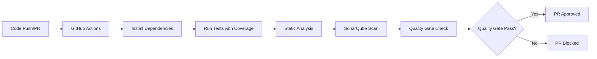

# SonarQube Integration Guide

This document provides comprehensive information about the SonarQube integration for the SoftMax Installer package.

## Overview

SonarQube is integrated into our development workflow to ensure the highest code quality standards. It provides:

- **Static Code Analysis**: Detects bugs, vulnerabilities, and code smells
- **Code Coverage**: Tracks test coverage across the codebase
- **Technical Debt**: Measures maintainability and complexity
- **Security Analysis**: Identifies security vulnerabilities and hotspots
- **Quality Gates**: Enforces quality standards before code merges

## Setup

### 1. SonarQube Server Configuration

Configure your SonarQube server with the following project settings:

```properties
# Project Configuration
Project Key: mdiqbalhossan_installer
Project Name: SoftMax Installer Package
Organization: mdiqbalhossan
Main Branch: main
```

### 2. GitHub Repository Secrets

Add the following secrets to your GitHub repository:

```
SONAR_TOKEN=your_sonarqube_project_token
SONAR_HOST_URL=https://your-sonarqube-instance.com
CODECOV_TOKEN=your_codecov_token (optional)
```

### 3. Quality Gate Configuration

Set up quality gates in SonarQube with these conditions:

#### Coverage
- Coverage on New Code: >= 80%
- Duplicated Lines (%) on New Code: < 3%

#### Maintainability
- Maintainability Rating on New Code: A
- Technical Debt Ratio on New Code: <= 5%

#### Reliability
- Reliability Rating on New Code: A
- Bugs on New Code: 0

#### Security
- Security Rating on New Code: A
- Vulnerabilities on New Code: 0
- Security Hotspots Reviewed on New Code: 100%

## Workflow Integration

### Automated Analysis

SonarQube analysis runs automatically:

1. **On Push**: To main and develop branches
2. **On Pull Request**: For all PRs to main and develop
3. **Manual Trigger**: Via GitHub Actions workflow dispatch

### Analysis Process



## Local Development

### Running Analysis Locally

```bash
# Install dependencies
composer install

# Prepare analysis environment
composer sonar-prepare

# Run full analysis with coverage
composer sonar-analysis

# Run individual components
composer format-check    # Code formatting
composer analyse         # Static analysis
composer test-coverage   # Tests with coverage
```

### Manual SonarQube Scanner

```bash
# Download SonarQube Scanner
wget https://binaries.sonarsource.com/Distribution/sonar-scanner-cli/sonar-scanner-cli-4.8.0.2856-linux.zip
unzip sonar-scanner-cli-4.8.0.2856-linux.zip
export PATH=$PATH:./sonar-scanner-4.8.0.2856-linux/bin

# Run analysis
sonar-scanner \
  -Dsonar.projectKey=mdiqbalhossan_installer \
  -Dsonar.sources=src \
  -Dsonar.tests=tests \
  -Dsonar.host.url=$SONAR_HOST_URL \
  -Dsonar.login=$SONAR_TOKEN \
  -Dsonar.php.coverage.reportPaths=build/coverage/clover.xml
```

## Configuration Files

### sonar-project.properties

Main configuration file defining:
- Project metadata
- Source and test directories
- Coverage report paths
- Analysis exclusions
- Quality gate settings

### .github/workflows/sonarqube.yml

GitHub Actions workflow that:
- Sets up PHP environment with coverage
- Installs dependencies
- Runs tests and generates coverage
- Executes SonarQube analysis
- Uploads results and artifacts
- Comments on PRs with analysis results

### phpunit.xml

Updated PHPUnit configuration with:
- Coverage reports in multiple formats
- Test result logging
- Optimized settings for SonarQube

## Quality Metrics

### Code Coverage

- **Target**: Minimum 80% coverage on new code
- **Formats**: Clover XML, HTML reports, Cobertura
- **Exclusions**: View files, service providers (boilerplate)

### Maintainability

- **Technical Debt**: Maximum 5% ratio
- **Complexity**: Cyclomatic complexity monitoring
- **Code Smells**: Zero tolerance on new code

### Security

- **Vulnerabilities**: Zero tolerance
- **Security Hotspots**: 100% review required
- **OWASP Top 10**: Automated detection

### Duplication

- **Threshold**: Maximum 3% duplicated lines
- **Detection**: Block-level duplication analysis
- **Exclusions**: Migrations, configuration files

## Troubleshooting

### Common Issues

#### Coverage Not Appearing

```bash
# Ensure Xdebug is enabled
php -m | grep xdebug

# Check coverage file exists
ls -la build/coverage/clover.xml

# Verify file paths in coverage report
cat build/coverage/clover.xml | head -20
```

#### Quality Gate Failures

1. **Coverage too low**: Add more tests
2. **New bugs detected**: Fix identified issues
3. **Security vulnerabilities**: Address security concerns
4. **Duplicated code**: Refactor duplicate blocks

#### Analysis Timeouts

```yaml
# Increase timeout in workflow
timeout-minutes: 15

# Use shallow clone depth
fetch-depth: 1
```

### Debug Commands

```bash
# Check SonarQube properties
cat sonar-project.properties

# Verify test execution
composer test -- --verbose

# Check coverage generation
composer test-coverage
ls -la build/coverage/

# View SonarQube logs
cat .scannerwork/report-task.txt
```

## Best Practices

### Code Quality

1. **Write Tests First**: Maintain high coverage from the start
2. **Small Commits**: Easier to pass quality gates
3. **Regular Analysis**: Don't accumulate technical debt
4. **Address Issues Early**: Fix problems before they compound

### Performance

1. **Incremental Analysis**: Only analyze changed code when possible
2. **Cache Dependencies**: Use GitHub Actions cache
3. **Parallel Execution**: Run tests and analysis in parallel
4. **Exclude Non-Essential Files**: Optimize analysis scope

### Maintenance

1. **Update Quality Gates**: Regularly review and adjust standards
2. **Monitor Trends**: Track quality metrics over time
3. **Team Training**: Ensure team understands quality requirements
4. **Documentation**: Keep integration docs up to date

## References

- [SonarQube Documentation](https://docs.sonarqube.org/)
- [SonarQube PHP Analysis](https://docs.sonarqube.org/latest/analysis/languages/php/)
- [GitHub Actions Integration](https://github.com/SonarSource/sonarqube-scan-action)
- [Quality Gates Guide](https://docs.sonarqube.org/latest/user-guide/quality-gates/)